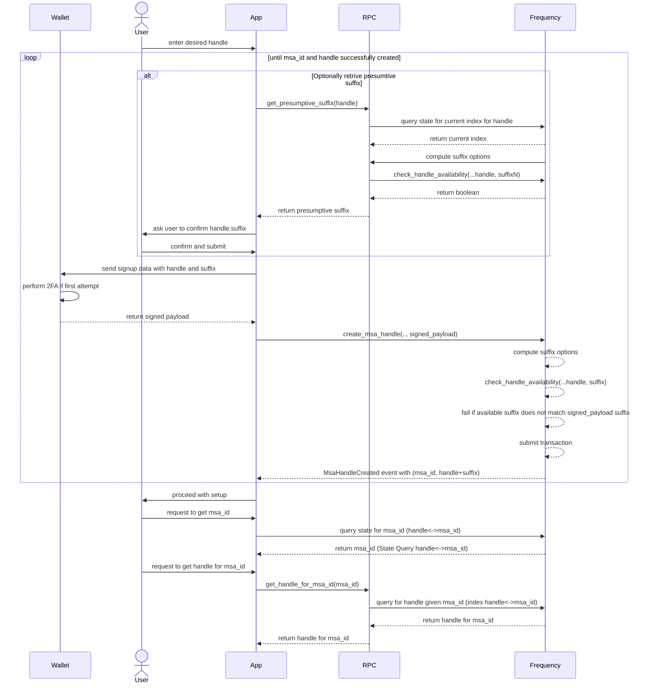
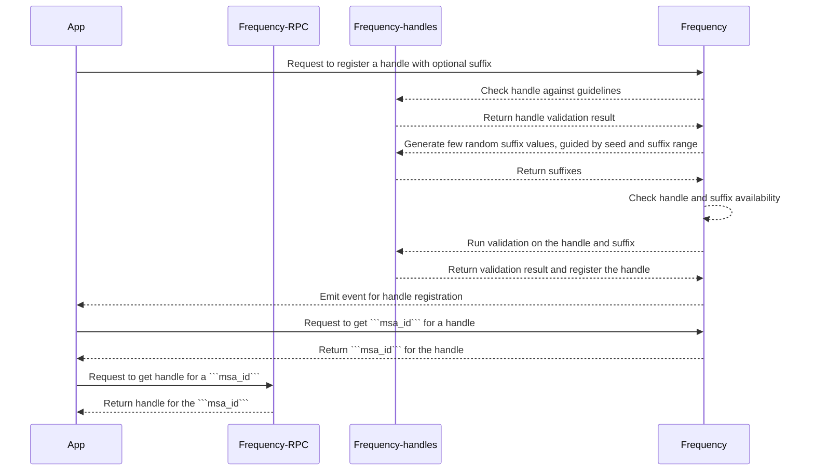

# Managing User Handles
The Frequency blockchain aims to provide a mechanism to register and retrieve user handles on chain to make it easier to use MSA Ids.
To achieve this, we have created a user handle ```registry``` system on Frequency , coupled with ```MessageSourceAccount```, that allows users to choose a handle for their MSA Ids.  The Handle system then appends an available numeric suffix to the chosen user handle, separated by a delimiter[.], to make it unique and store the mapping of the handle to the MSA Id in the registry.

The user handle system also enforces guidelines to ensure that handles are user-friendly and easy to remember and prevent misuse and abuse.

## Assumptions
 ```MessageSourceAccount``` exists for a user to create a handle.
* It is optional for a user to create a handle.
* Handles are unique and have a 1:1 mapping with ```MessageSourceAccount```.
* Governance will define the range of suffixes allowed for a given handle.
* Governance will define the time period a handle must be retired before it can be reused.
* The handle create/change/(and retire, if its not feeless) supports capacity based transactions.
### General Steps

* Create a randomly shuffled array of numeric suffixes.
* For each base handle requested, a storage map will be created with a randomly generated start index (in to the shuffled array) and a current index.  The current index will be incremented each time a new suffix is requested.
* When the current index reaches the start index, all suffixes are exhausted and an error is returned.
* Query the chain to check which values are available, check if the handle with the suffix is available.
* Choose an available value and attempt to claim it by submitting the full handle with the suffix to the chain.
* Chain validates the handle and suffix and maps the handle to the ```msa_id```.
* Chain maintains a reverse mapping from handle to msa for offchain use.

### Chain Steps

* When a user submits a base handle, check the numeric suffix for availability and that it honors range defined for suffix window.
* Store ```msa_id``` to ```handle``` mapping and ```handle``` to ```msa_id``` mapping.

### Handling Race Conditions

There is an exceedingly small chance that two users may attempt to claim the same handle and suffix combination within the same block. In such cases, the transaction fails to create the MSA, and the app receives a failure for the transaction rather than the expected MsaHandleCreated event.

## Sequence Diagram



## Storage

* **HandleSuffixMin**: This storage value (```u32```) keeps track of the minimum suffix value allowed for a given handle.
* **HandleSuffixMax**: This storage value (```u32```) keeps track of the maximum suffix value allowed for a given handle.
* **HandleRetirementPeriod**: This storage value (```u32```) keeps track of the number of blocks a handle must be retired before it can be reused.
* **MSAIdToUserHandle**: This storage maps MSAIds to their corresponding user handles.
* **UserHandlesToMSAId**: This storage maps user handles to their corresponding MSAIds.
* **RetiredHandles**: This storage keeps track of all retired handles and the block number at which they were retired. T

## Required Extrinsics

### Primitives

``` rust

MsaHandlePayload {
    display_handle: &[u8],
}
```

display_handle is the handle that the user wants to use. This is the handle that will be displayed to other users.

### Create user handle with chosen handle

 As a network, Frequency should allow users to choose their own handle, while chain will generate a random numeric suffix within the range of suffixes allowed. The full handle will be the handle with the suffix.

``` rust
Input

* origin - must be a signed origin
* owner_key - the public key of the owner. This is used to verify the signature and resolve the MSA ID.
* proof - the proof of ownership of the handle, ```MsaHandlePayload``` signed by the owner's private key

Output
* Event - `HandleCreated` with the MSA ID and the handle

* Errors - 
    * `HandleAlreadyExists` if the handle already exists
    * `InvalidMsaHandle` if the handle is invalid
    * `Unauthorized` if the signature is invalid
    * `InvalidSuffix` if the suffix is invalid

Validation requirements
* handle must follow handle guidelines.
* handle must be unique.
* handle must be available.
* suffix must be available.
* suffix must be in the range of the handle.
* MSA ID must exist. Signing keys must resolve to MSA ID.

Signature requirements

The extrinsic must be signed by the owner's private key. The signature must be verified on-chain to ensure that the user is the owner of the private key. Without the possibility of a replay attack, the chain can verify that the user is the owner of the handle and no special mechanism to handle signature reuse is required.
```

### Retire user handle

As a network, Frequency should allow users to retire their handles. This extrinsic will allow users to retire their handles. Retired handles will be available for reuse after a time period set by governance.

``` rust
Input

* origin - must be a signed origin
* owner_key - the public key of the owner. This is used to verify the signature and resolve the MSA ID.
* proof_of_ownership - the proof of ownership of the handle to be retired, ```MsaHandlePayload``` signed by the owner's private key

Output

* Event - `HandleRetired` with the handle

* Errors - 
    * `HandleDoesNotExist` if the handle does not exist
    * `Unauthorized` if the signature is invalid

Validation requirements
* MSA ID must exist. Signing keys must resolve to MSA ID.
* handle must exist and be owned by the MSA ID.

Signature requirements

The extrinsic must be signed by the owner's private key. The signature must be verified on-chain to ensure that the user is the owner of the private key.
```


### Change handle

As a network, Frequency should allow users to change their handles. This extrinsic will allow users to change their handles. Retired handles will be available for reuse after a time period set by governance.

``` rust
Input
* origin - must be a signed origin
* owner_key - the public key of the owner. This is used to verify the signature and resolve the MSA ID.
* proof_of_new_ownership - the proof of ownership of the new handle, ```MsaHandlePayload``` signed by the owner's private key

Output
* Event - `HandleChanged` with the old handle and the new handle
* Errors - 
    * `HandleDoesNotExist` if the handle does not exist
    * `Unauthorized` if the signature(s) is invalid
    * `InvalidMsaHandle` if the handle is invalid

Validation requirements
* MSA ID must exist. Signing keys must resolve to MSA ID.
* old handle must exist and be owned by the MSA ID.
* new handle must follow handle guidelines.
* new handle must be unique.
* new handle must be available.
* new suffix must be available.
* new suffix must be in the range of the handle.

Signature requirements

The extrinsic must be signed by the user private key. The signature must be verified on-chain to ensure that the user is the owner of the private key. The signature must also include the old handle and the new handle to prevent unauthorized handle changes.
```

## Governance Issues

### Governance to alter min max range

As a network, Frequency allows governance to alter the min and max range for suffixes. This extrinsic allows governance to alter the min and max range for suffixes.

``` rust
Input

* Min and Max range for suffix (u32) - the minimum and maximum values for the suffix range that users can choose from

Output

* Event - `HandleSettingsChanged` with the min and max range and the handle merging setting

```

### Governance to alter handle retirement period

As a network, Frequency allows governance to alter the handle retirement period. This extrinsic will allow governance to alter the handle retirement period.

``` rust
Input

* Handle retirement period (u32) - the number of blocks after which a retired handle will be available for reuse

Output

* Event - `HandleExpiryPeriodSet` with the handle retirement period

```

## RPCs

* RPC to get the full handle (handle + suffix) given a ```msa_id```.
* RPC to get the current seed (more of a chain utility for general use).
* RPC to get a set of available suffixes given a handle (Not important for v1, however nice to have)

## Overview for Frequency-handles

Frequency-handles provide the following functionality:

### Translation

Given a user handle and a seed, the crate provides a function that generates a suffix for the handle. This function is used to generate a suffix for a user handle when creating a new handle. Typical operations will be:

* Generate a suffix for a user handle using the current seed and suffix range.
* Create a PRNG helper function that takes a seed and generates a sequence of suffixes.

### Verification

Provides a verification function that takes a user handle and a suffix and verifies that the handle is valid and the suffix is available. This function is used to verify a handle and suffix when a user attempts to create a new handle or change their handle. Typical operations will be:

* Verify that the handle is valid, i.e. it follows the handle guidelines.
* Check for homoglpyhs.

### PRNG

Uses a PRNG (pseudo-random number generator) to generate suffix values for user handles. The PRNG takes a seed value derived from the current block's Merkle root and the user's desired handle base, and generates a sequence of 10/20 values that will be used as suffixes. These suffixes will then be checked for availability on the chain before attempting to create a new handle.

## Frequency-handles crate sequence diagram



