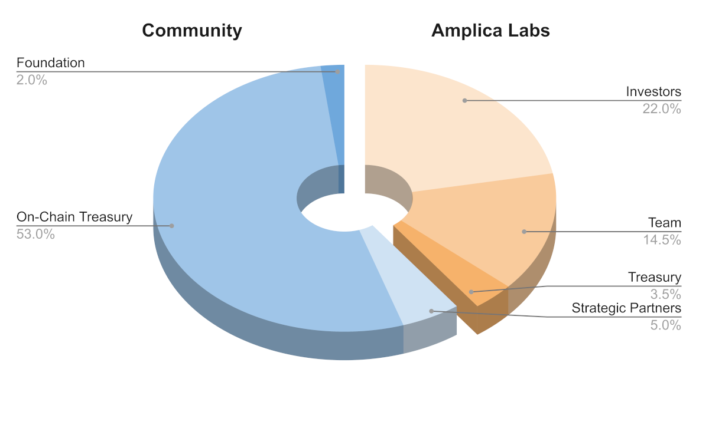

# Initial Token Distribution

One billion FRQCY were created at Genesis and allocated as follows:

- Frequency Network Foundation
    - Foundation: 2.0%
    - On-Chain Treasury: 53.0%
    - Strategic Partners: 5.0%
- Amplica Labs
   - Investors: 22.0%
   - Team: 14.5%
   - Treasury: 3.5%

